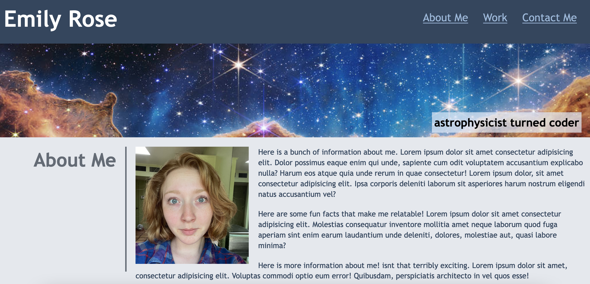
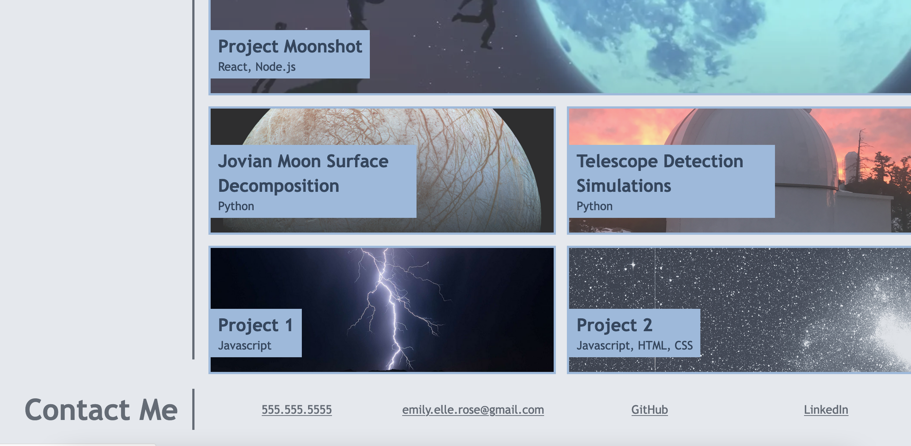

# No-javascript portfolio webpage (module 2 challenge)

## Description
This project was built from scratch to get a handle on working with HTML and CSS in order to build a webpage. It isn't very interactive, beyond being responsive and having clickable links, but I learned a lot from trying to style it to match the mockup. 

## Installation
Go to the git-hosted website in order to access the completed webpage.

## Usage
The nav bar in the upper right scrolls the user to the appropriate section when that particular link is clicked. Similarly, the links at the bottom in the "contact me" section all go or could go to their respective sites. 

The images in the "works" section are all placeholders that would theoretically link to particular github-hosted projects / applications. They have a slight opacity filter applied that vanishes when they are hovered over.

## Credits
I used a stack overflow response to absolutely position the subtitle (centered) over the hero image

## License
I am still very confused about licensing, to be honest.